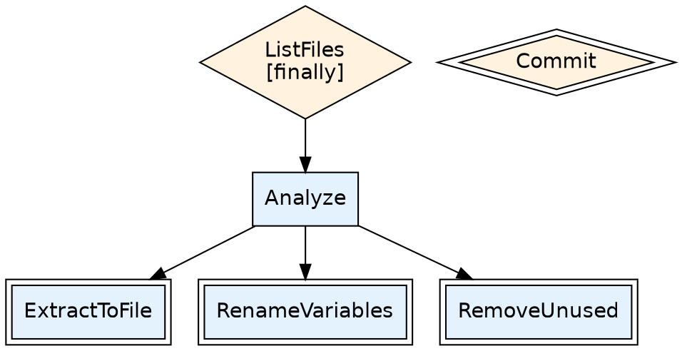

# Visualization

GSD can generate a graph of your workflow config before anything runs. This is useful for understanding the shape of complex workflows, verifying transitions, and sharing with teammates.

## Usage

```bash
gsd config graph --config config.jsonc
```

This outputs [DOT format](https://graphviz.org/doc/info/lang.html) (GraphViz) to stdout. Pipe it to `dot` to render an image:

```bash
# SVG (best for docs and web)
gsd config graph --config config.jsonc | dot -Tsvg -o workflow.svg

# PNG
gsd config graph --config config.jsonc | dot -Tpng -o workflow.png

# PDF
gsd config graph --config config.jsonc | dot -Tpdf -o workflow.pdf
```

You need [GraphViz](https://graphviz.org/download/) installed for rendering. On macOS: `brew install graphviz`.

## Visual encoding

The graph encodes step types and structure visually:

| Visual | Meaning |
|--------|---------|
| Blue box | Agent step (Pool action) |
| Orange diamond | Shell command (Command action) |
| Double border | Terminal step (no outgoing `next` transitions) |
| `[pre]`, `[post]`, `[finally]` | Hooks attached to the step |
| Arrows | `next` transitions between steps |

## Example

This config defines a branching refactor workflow: list files, analyze each one, then route to a specialized refactoring agent. A `finally` hook on ListFiles commits all changes when the subtree completes.

```jsonc
{
  "entrypoint": "ListFiles",
  "steps": [
    {
      "name": "ListFiles",
      "action": {
        "kind": "Command",
        "script": "find src -name '*.rs' | jq -R '{kind: \"Analyze\", value: {file: .}}' | jq -s '.'"
      },
      "next": ["Analyze"],
      "finally": "echo '[{\"kind\": \"Commit\", \"value\": {\"message\": \"Apply refactors\"}}]'"
    },
    {
      "name": "Analyze",
      "action": {
        "kind": "Pool",
        "instructions": { "inline": "Read the file. Decide which refactor it needs. Return one task." }
      },
      "next": ["ExtractToFile", "RenameVariables", "RemoveUnused"]
    },
    {
      "name": "ExtractToFile",
      "action": { "kind": "Pool", "instructions": { "inline": "Extract the specified code into a new file. Return []." } },
      "next": []
    },
    {
      "name": "RenameVariables",
      "action": { "kind": "Pool", "instructions": { "inline": "Rename variables for clarity. Return []." } },
      "next": []
    },
    {
      "name": "RemoveUnused",
      "action": { "kind": "Pool", "instructions": { "inline": "Remove unused code. Return []." } },
      "next": []
    },
    {
      "name": "Commit",
      "action": { "kind": "Command", "script": "jq -r '.value.message' | xargs -I{} git commit -am '{}' && echo '[]'" },
      "next": []
    }
  ]
}
```

Running `gsd config graph` on this config produces:

<div style={{textAlign: 'center'}}>


</div>

### Reading the graph

- **ListFiles** (orange diamond) is a command that fans out to **Analyze** tasks
- **Analyze** (blue box) is an agent that routes to one of three specialized refactoring steps
- **ExtractToFile**, **RenameVariables**, **RemoveUnused** (blue boxes, double border) are terminal agent steps
- **Commit** (orange diamond, double border) is a terminal command — it appears disconnected because it's spawned by ListFiles's `finally` hook, not by a `next` transition
- The `[finally]` annotation on ListFiles shows it has a finally hook attached

## What the graph does not show

The graph shows the **static transition structure** — what `next` transitions are declared in the config. It does not show:

- **Finally hook targets**: Steps spawned by `finally` hooks appear as disconnected nodes since they're created at runtime, not via `next`
- **Runtime fan-out**: A single command step might spawn 50 tasks at runtime, but the graph shows one edge
- **Retry paths**: Failed tasks that get retried follow the same edges
- **Pre/post hook transformations**: Hooks can modify task data but don't change the graph structure

## DOT output

The raw DOT output for the example above:



You can edit this DOT directly to customize the visualization — add labels to edges, change colors, group nodes into subgraphs, etc.
